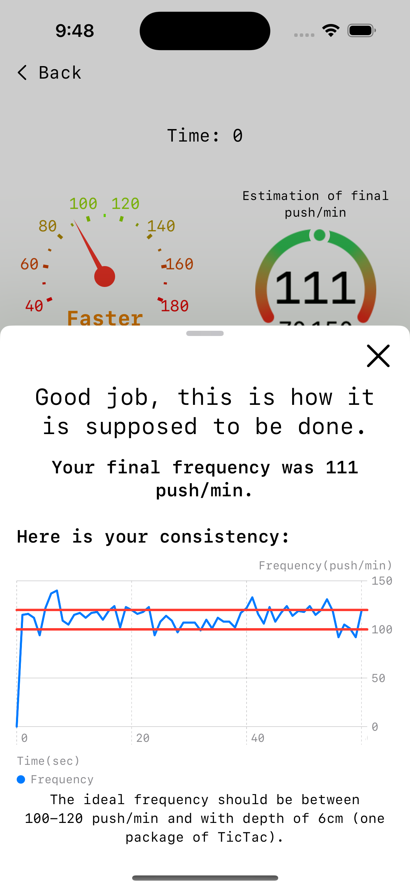

# CPR Helper

## Overview
CPR Helper is an educational and emergency support app developed in Swift using Xcode. The app is designed to guide users through the correct steps of performing CPR in case of an emergency while also providing a learning section with exercises and simulations to reinforce proper CPR techniques.

## Features
- **Emergency Assistance:** Provides step-by-step guidance for CPR procedures during an emergency.
- **Practice Mode:** Offers interactive learning with small simulations to teach correct hand placement and rhythm.
- **Minimalist UI:** A simple and familiar interface with three main buttons for quick navigation, ensuring easy access to the emergency button.
- **SwiftUI-Based Design:** Built using SwiftUI to maintain a consistent look and feel across all views.
- **Customizable Emergency Numbers:** Supports different emergency service numbers based on the user's country.

## User Experience Goals
- **Consistency:** UI elements are reused across different views to create a seamless experience.
- **Simplicity:** A clean layout with minimal distractions, ensuring users can quickly access crucial information.
- **Accessibility:** Designed to be intuitive, even for users in high-stress situations.

## Sreenshots
  

## Technologies Used
- **Swift**: Core programming language
- **SwiftUI**: UI framework for a modern, cohesive design
- **Foundation**: Essential data management framework

## Installation
To use CPR Helper, download and install the app from the App Store or run the project in Xcode by cloning the repository and building it on a compatible iOS device.

## Opening the Project from GitHub
1. Clone the repository:
   ```sh
   git clone https://github.com/risasim/CPRHelperv2.git
   ```
2. Navigate to the project directory:
   ```sh
   cd cpr-helper
   ```
3. Open the project in Xcode:
   ```sh
   open CPRHelperv2.xcodeproj
   ```
4. Select a simulator or a connected device and build the project by pressing `Cmd + R`.

## Future Improvements
- Integration of real-time feedback on CPR performance using motion tracking.
- Enhanced localization support for additional languages.
- Expansion of interactive simulations for a more immersive learning experience.

## Acknowledgments
This app was developed for the Swift Student Challenge 2025 to promote CPR education and emergency preparedness.

